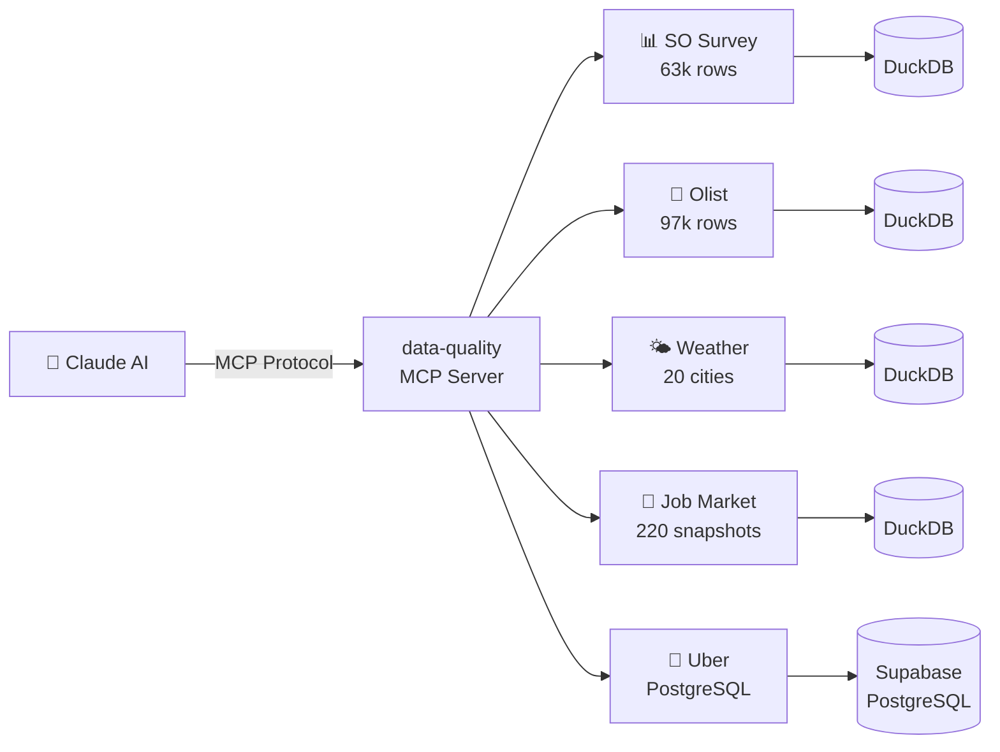

# Ask your data. Claude answers.

### MCP Data Quality Agent — 19 tools · 5 databases · natural language

<p align="center">
  <a href="https://github.com/evgeniimatveev/mcp-data-quality-agent/actions/workflows/quality_check.yml">
    
  </a>
  
  
  
  
  
</p>

An MCP server that gives Claude direct, read-only access to four DuckDB databases and a Supabase PostgreSQL instance. Claude picks the right tool, writes the SQL, runs it, and interprets the result — no copy-paste, no context-switching, no boilerplate.

---

## Screenshots

<details>
<summary>🔌 MCP Server — connected and ready</summary>


</details>

<details>
<summary>📡 list_sources — all 5 databases healthy</summary>


</details>

<details>
<summary>🧠 smart_summary — one-call dataset overview</summary>


</details>

<details>
<summary>📊 segment_analysis — salary by tech stack</summary>


</details>

<details>
<summary>🔗 correlation — salary vs demand (Pearson + Spearman)</summary>


</details>

<details>
<summary>🩺 quality_report — nulls, duplicates, numeric stats</summary>


</details>

<details>
<summary>🔍 find_anomalies — IQR outlier detection</summary>


</details>

<details>
<summary>⚡ run_query — freeform SQL via MCP</summary>


</details>

<details>
<summary>🔬 profile_column — full statistical portrait of one column</summary>


</details>

<details>
<summary>🏆 top_n_by_group — top 3 salaries per tech stack</summary>


</details>

<details>
<summary>✅ freshness_check — pipeline health status</summary>


</details>

<details>
<summary>💡 Bottom Line — 3 data-driven insights</summary>


</details>

---

## What a session looks like

```
You:    "Which tech stacks in the SO Survey have the highest salary but lowest
         representation — hidden gems for job seekers?"

Claude: [calls segment_analysis → so_survey · main.survey · tech_stack · salary_usd]
        [calls column_distribution → so_survey · main.survey · tech_stack]

        → Scala: $187k median, only 2.1% of respondents
          Erlang: $168k, under 1%
          Go: $140k, 8.4% — most accessible of the three
```

```
You:    "Something feels off with the Olist revenue data — run a full check."

Claude: [calls quality_report  → olist · main_marts.mart_revenue]
        [calls find_anomalies  → olist · main_marts.mart_revenue · gross_revenue]
        [calls null_pattern    → olist · main_marts.mart_revenue]

        → 97,276 rows. 0 nulls. 7,592 outliers (7.8%) — all in fixed_telephony category.
          Top offender: $13,440 single order. Not a data error — high-ticket items.
```

```
You:    "Is the weather pipeline still fresh, and how has temperature trended this month?"

Claude: [calls freshness_check → weather · main.weather_history · fetched_at]
        [calls time_series     → weather · main.weather_history · fetched_at · temperature_c · day · trajectory]

        → FRESH — last record 4 hours ago.
          NYC: +3.2°C above 7-day average. Chicago trending cold (-2.1°C).
```

---

## 19 tools

### Discovery

| Tool | What it does |
|------|-------------|
| `list_sources` | All connected sources with live status |
| `list_tables(source)` | Tables in a source — `schema.table` format for multi-schema DBs |
| `describe_table(source, table)` | Column types · row count · 3-row sample |
| `run_query(source, sql)` | Execute any `SELECT` / `WITH` — read-only enforced |

### Quality

| Tool | What it does |
|------|-------------|
| `quality_report(source, table)` | Null counts · duplicate rate · numeric stats per column |
| `null_pattern(source, table, min_nulls)` | Co-null patterns — which columns go null together |
| `duplicate_check(source, table, key_cols)` | Exact duplicates on a specific key or composite key |
| `find_anomalies(source, table, column, return_rows)` | IQR outlier detection — summary stats or full row context |
| `smart_summary(source, table)` | One-call narrative: size · quality · numeric · categorical highlights |

### Exploration

| Tool | What it does |
|------|-------------|
| `column_distribution(source, table, column, top_n)` | Categorical: top-N value counts · Numeric: 8-bucket histogram |
| `profile_column(source, table, column)` | Full portrait — type · nulls · uniques · Q1/Q3/IQR · skew · top values |
| `correlation(source, table, col1, col2)` | Pearson + Spearman (rank-based, no scipy required) |
| `segment_analysis(source, table, group_col, value_col)` | `GROUP BY` — count / sum / mean / median / std per segment |
| `top_n_by_group(source, table, group_col, value_col, n)` | Window-function top-N rows within each group |

### Time Series & Statistics

| Tool | What it does |
|------|-------------|
| `freshness_check(source, table, date_col)` | Latest entry · days since update · `FRESH` / `OK` / `STALE` label |
| `time_series(source, table, date_col, value_col, period, mode)` | Trend over `day/week/month` — raw trajectory or MoM % delta |
| `significance_test(source, table, group_col, value_col)` | Welch's t-test + Mann-Whitney U + Cohen's d — requires exactly 2 groups |

### Output

| Tool | What it does |
|------|-------------|
| `compare_tables(source1, table1, source2, table2)` | Row counts · shared columns · unique columns |
| `export_csv(source, sql, filename)` | Any query → CSV saved to Desktop |

---

## Connected datasets

| Source key | Engine | Rows | Dataset |
|-----------|--------|------|---------|
| `so_survey` | DuckDB | 63k | Stack Overflow Developer Survey 2024 |
| `olist` | DuckDB | 97k | Brazilian e-commerce — orders · revenue · reviews (multi-schema dbt) |
| `weather` | DuckDB | growing | Global Weather Pipeline — 20 cities · 6 continents · 2× daily |
| `jobs` | DuckDB | 220 | Job Market Pulse — daily Adzuna API snapshots |
| `uber` | Supabase PostgreSQL | 3.7k | Real Uber trip data — trips · payments · ratings |

---

## Architecture



Claude never sees a connection string. The server is the only layer that touches data — Claude only sees what tools return.

---

## Security model

| Constraint | How it's enforced |
|-----------|-------------------|
| Read-only DuckDB | `duckdb.connect(path, read_only=True)` |
| Read-only PostgreSQL | `con.set_session(readonly=True, autocommit=True)` |
| No DDL / DML via `run_query` | Statement rejected if it doesn't start with `SELECT` or `WITH` |
| CTE-wrapped mutations blocked | Read-only session catches `WITH x AS (DELETE ...)` at the DB level |
| No credentials in code | All paths and secrets in `.env` — never committed |

---

## Testing

All 19 tools are validated against a 33-test checklist covering routing accuracy, confusion pairs, security, and edge cases.

| Block | Coverage | Last run |
|-------|----------|----------|
| A — Routing (20 prompts) | Every tool triggered by natural language | 20/20 ✅ |
| B — Confusion pairs (5 prompts) | Tools that previously mixed up | 5/5 ✅ |
| C — Security / read-only (3 tests) | DELETE · CTE-DELETE · multi-statement | 3/3 ✅ |
| D — Edge cases (5 tests) | BIGINT date trap · high cardinality · 3+ groups | 5/5 ✅ |

See [`TESTING.md`](TESTING.md) for full prompts, expected routing, and two complete run logs.

---

## Setup

```bash
git clone https://github.com/evgeniimatveev/mcp-data-quality-agent
cd mcp-data-quality-agent
pip install -r requirements.txt
cp .env.example .env   # fill in your DuckDB paths + PostgreSQL credentials
```

Register with Claude Code (available in any project):

```bash
claude mcp add data-quality --scope user -- python /path/to/server.py
```

Or add to Claude Desktop (`%APPDATA%\Claude\claude_desktop_config.json`):

```json
{
  "mcpServers": {
    "data-quality": {
      "command": "python",
      "args": ["C:/path/to/mcp-data-quality-agent/server.py"]
    }
  }
}
```

Verify it's live:

```bash
claude mcp list
# data-quality: python .../server.py  ✓ Connected
```

---

## Project structure

```
mcp-data-quality-agent/
├── server.py                      # FastMCP server — 19 tools
├── requirements.txt               # mcp · duckdb · psycopg2-binary · pandas · scipy · python-dotenv
├── TESTING.md                     # 33-test checklist · 2 complete run logs
├── .env.example                   # template — copy to .env and fill in
├── assets/                        # screenshots for README
├── .github/
│   └── workflows/
│       └── quality_check.yml      # smoke-test: verifies all 19 tools on every push
└── .gitignore                     # .env · __pycache__ · *.duckdb excluded
```

---

*Built by [Evgenii Matveev](https://github.com/evgeniimatveev) · Python · FastMCP · DuckDB · PostgreSQL · pandas*
